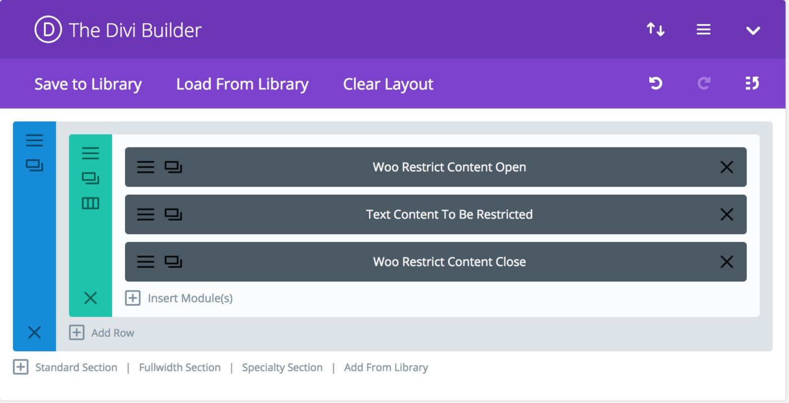
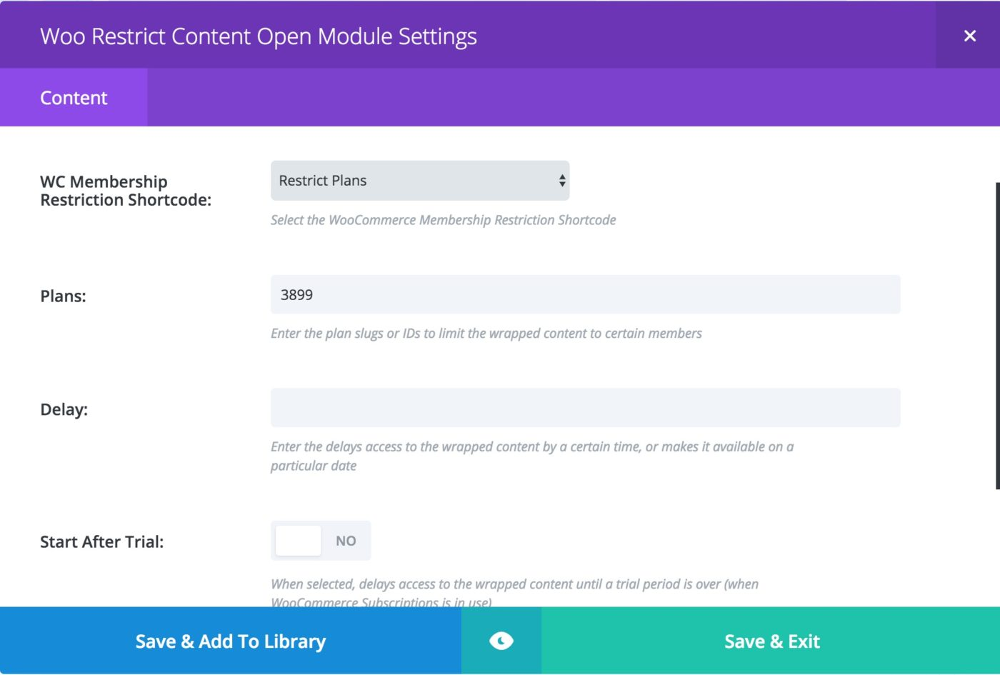
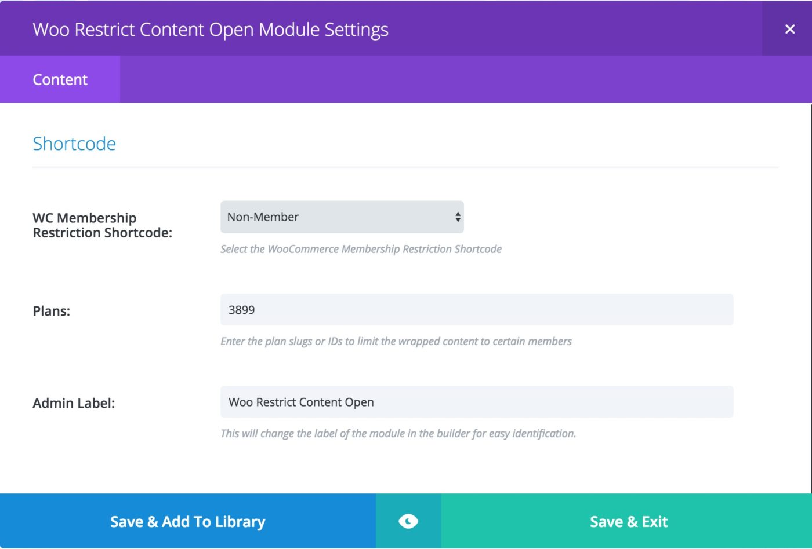
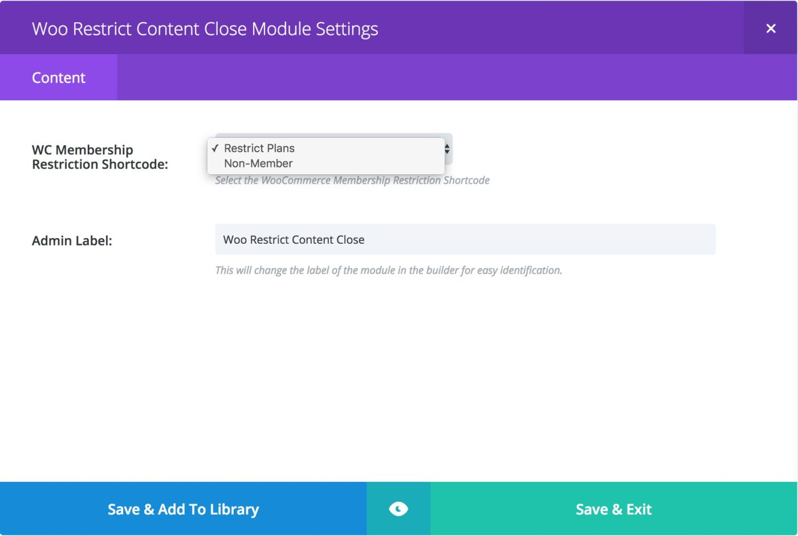

# Woo Member Restrict Module - [www.mrkwp.com](https://www.mrkwp.com/)

If you use memberships with WooCommerce and Divi, you may have some trouble doing page layouts.

We did, so we fixed the problem with this cool Divi Module.

It allows you to change what you show to customers in your Divi Builder Pages.

This is a great way to restrict content and show what you need to the right members on your site.

It’s invaluable to get fantastic content showing to your paying members.

> Note: Headsup! We have moved on to other things & in spirit of GPL2 & WordPress ecosystem we have released the source code. We won't be developing or support this plugin. 

## The Shortcode Functionality

We created this module to be an overlay for Divi to use the shortcodes that come standard in the WooCommerce Memberships module.

You can read the documentation here on the official WooCommerce Site.

Normal shortcodes cannot be placed in the native Divi Builder around other content so you end up with problems delivering this functionality.

With the new Divi Plugin, you can place this around existing content to perform advanced functions.

You may want to restrict an in page download to members and otherwise show a signup button. With this module, you can do that.

You could even show entirely different content to a section.

It does have some limitations. You cannot place the module in separate sections.

## How to

The WooCommerce Membership Restrict Content Divi Module depends on the [https://woocommerce.com/products/woocommerce-memberships/](https://woocommerce.com/products/woocommerce-memberships/) plugin used to restrict your site’s content using site-wide membership.

### Restricting Content ###

This plugin has two divi modules

* **Woo Restrict Content Open** : This divi module, opens the shortcode, post which the content is restricted until the Woo Restrict Content Close divi module is encountered.
* **Woo Restrict Content Close**: This divi module closes the opened shortcode via Woo Restrict Content Open.

More information on the shortcodes can be found at [https://docs.woocommerce.com/document/woocommerce-memberships-restrict-content/](https://docs.woocommerce.com/document/woocommerce-memberships-restrict-content/)

### Woo Restrict Content Open Divi Module ###

One can use this module to open the or the shortcode. Module has field called WC Membership Restriction Shortcode whose options are

#### Restrict Plans

When selected, it restricts contents by plans. Attributes include plans, delay, start after trial

* Plans: Comma separated list of plan IDs/slug.
* Delay: Delay access to content by specific dates or human-readable time difference.
* Start After Trial: When selected, content is shown after trial period is done.

The image below shows how the two modules are used to restrict content.

#### Non Members

Used to restrict content for non-members. Attribute is plans.

* Plans: Comma separated list of plan IDs/slug.

### Woo Restrict Content Close Divi Module

This is used to close the shortcode tag introduced by the Woo Restrict Content Open Divi Module.

> Note: Please ensure that the shortcode selected should match the open choosen in the Woo Restrict Content Open module

